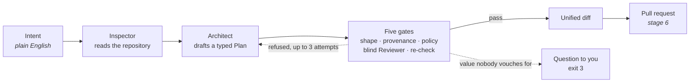

<h1 align="center">idp-agent</h1>

<p align="center">
  <strong>An AI agent for platform engineering that turns plain-English requests into
  reviewed Backstage catalog and GitOps pull requests.</strong><br>
  It never writes to <code>main</code>: the merge is the approval.
</p>

<p align="center">
  <a href="https://github.com/pcaboor/idp-agent/actions/workflows/ci.yml"></a>
  <a href="LICENSE"></a>
  = 22" src="https://img.shields.io/badge/node-%3E%3D22-brightgreen.svg">
  
  <!-- TODO: npm badge once published — https://img.shields.io/npm/v/idp-agent -->
</p>

<p align="center">
  <!-- TODO: replace with the asciinema recording planned for stage 7 -->
  
</p>

```text
$ idp-agent plan "give billing-api read access to the orders database in prod"
```

**What you get:** a typed plan, checked by five gates, rendered as a unified diff of YAML
declarations. If a value can't be traced to your request or your repository, it asks you
instead of guessing.

---

## Why idp-agent?

Internal developer platforms (IDPs) built on **Backstage** and **GitOps** run on
declarations: `catalog-info` YAML files in an infrastructure-as-code repository that CI
reconciles into databases, network access and firewall rules. Writing them by hand is slow
and error-prone. Letting an LLM write them unchecked is risky.

idp-agent sits between the two:

- 🗣️ **Natural language in, YAML out.** "Give billing-api read access to orders-db" becomes
  the exact entities to add, in your repository's own layout.
- 🔒 **The merge is the approval.** The agent proposes and a human reviews. Nothing is
  provisioned until a pull request is merged.
- 🧭 **Asks, never guesses.** Every owner, environment and access level must trace back to
  your request or to what your repository already holds. Anything else becomes a question.
- ✂️ **Minimal diffs.** It edits the text surgically and never reformats a file, so a
  reviewer sees one added line, not a reshuffled file.
- 🧪 **Reproducible without an API key.** 955 tests run offline from recordings: no
  network, no cost, no flaky model.

> Platform GitOps is the use case. The real subject is **how to build a reliable
> multi-agent LLM system**: deterministic orchestration, structural guardrails, a closed
> repair loop, and tests that never reach a model.

## Demo

<!-- TODO: replace with a screenshot or recording of the interactive run -->


Try it in two minutes. No API key is needed, because `plan --from` reads a plan from a file
and never calls a model:

```bash
git clone https://github.com/pcaboor/idp-agent && cd idp-agent
pnpm install && pnpm build

node dist/cli/bin.js init platform /tmp/my-iac --owner @acme/platform
node dist/cli/bin.js plan --from examples/declare-database.json --repo /tmp/my-iac
```

```diff
--- /dev/null
+++ b/catalog/databases/orders-db-prod.yml
@@ -0,0 +1,10 @@
+---
+apiVersion: backstage.io/v1alpha1
+kind: Resource
+metadata:
+  name: orders-db-prod
+  annotations:
+    company.fr/env: prod
+spec:
+  type: database
+  owner: group:default/tiger

1 file · nothing written
Nothing is provisioned yet. The merge is what authorises it.
```

When it can't vouch for a value, it asks instead:

```text
$ idp-agent plan --from examples/needs-an-owner.json --repo /tmp/my-iac
1 question, asked rather than guessed:

  operations.0.entity.spec.owner
      nothing vouches for this owner; which one is it?

Fill them in and run this again. Nothing was previewed, and nothing was written.
```

Explore the dependency graph of a fictional information system (33 entities) without any
model:

```text
$ idp-agent show billing-db-prod
resource:default/billing-db-prod

  kind         Resource
  type         database
  owner        group:default/tiger
  environment  prod

depends on
  resource:default/mysql-prod-01  prod

used by
  resource:default/billing-api-billing-db-prod  prod
  resource:default/reporting-billing-db-prod    prod

reached by services
  component:default/billing-api
  component:default/reporting-worker
```

## How it works



1. The **Inspector** reads the repository you're standing in.
2. The **Architect** proposes a `Plan` into a typed buffer, never free text.
3. **Five gates** judge it: schema shape, provenance (can each value be traced to a
   source?), policy, an independent Reviewer that never sees the Architect's reasoning,
   and a re-check against the repository as it is now.
4. After three failed attempts it stops cleanly.

The model decides *what to ask*. The deterministic engine answers, validates and renders.
A reference the tools never returned is refused, not printed.

## Install

> **Not on npm yet.** Publishing is planned for stage 7 (`npx idp-agent`). Until then,
> run it from a clone.

```bash
git clone https://github.com/pcaboor/idp-agent && cd idp-agent
pnpm install && pnpm build
pnpm link --global          # exposes `idp-agent` and the short alias `idpa`
```

<!-- TODO: once published
```bash
npx idp-agent               # guided tour, no setup, no API key
npm install -g idp-agent
```
-->

**Requirements:** Node ≥ 22, pnpm 10. No Docker, no database, no API key.

The model-backed commands (`ask`, `plan "<intent>"`) need a provider. **None is configured
by default**, and none is preferred:

```bash
export IDP_PROVIDER=anthropic   # or mistral, openai
export IDP_MODEL=<model-id>
```

## Commands

```bash
idp-agent graph [--env <env>] [--type <type>] [--kind Component|Resource] [--repo <dir>]
idp-agent show <name-or-reference> [--repo <dir>]
idp-agent ask "<question>" [--repo <dir>]        # needs IDP_PROVIDER and IDP_MODEL
idp-agent validate <directory>                   # what the generated CI runs
idp-agent init platform <dir> --owner @org/team  # the only command that writes
idp-agent plan --from <plan.json> --repo <dir>   # no model, and none is possible
idp-agent plan "<intent>" --repo <dir> [--json]  # needs IDP_PROVIDER and IDP_MODEL
idp-agent init [--repo <dir>]                    # the catalog-info.yml it would write
```

| Command | What it does |
|---|---|
| `graph`, `show` | Walk the dependency graph: who depends on what, which services reach a database. No model. |
| `ask` | Answers a question about your platform. The model picks the queries; the engine answers them. |
| `init platform` | Scaffolds the declarations repository, its CI and a branch-protection checklist. |
| `validate` | Checks a repository against the schemas. This is what the scaffolded CI runs. |
| `plan` | Turns an intent, or a `Plan` file, into a checked and previewed diff. |

`plan --repo` names the **declarations** repository. `init --repo` names the
**application** repository being declared. `graph`, `show` and `ask` take the first kind;
without `--repo` they read the fictional demo SI and say so on stderr.

**Exit codes:** `0` success · `1` negative answer (nothing matched, the repository doesn't
conform, or a gate refused the plan) · `2` bad arguments, or no model configured · `3`
understood but not acted on, including a value nobody can vouch for. An ambiguous name
resolves to nothing rather than to the first candidate.

## Design principles

The full doctrine is in [`docs/design.md`](docs/design.md) §4, and it isn't negotiable:

- **The merge is the act of authorisation.** The CLI opens a pull request. It never writes
  to the main branch.
- **Textual surgery, never a reparse.** A reviewer must see an added line, not a
  reformatted file.
- **Declare, never infer.** What is unknown is reported as unknown. An automaton reports;
  it doesn't delete.

It builds on a declarative reconciliation system that ran in production (CI/CD triggered
on `catalog-info.yml`, a central IaC repository, provisioning through an API gateway,
firewall automation and ticketing) and adds the multi-agent layer that system never had.

## Roadmap

| # | Stage | State |
|---|---|---|
| 0 | Foundations: schemas, serialiser, paths, invariants | ✅ |
| 1 | Read-only: `graph`, `show <entity>` | ✅ |
| 2 | Question mode: Supervisor, recordings | ✅ |
| 3 | `init platform` + `validate` | ✅ |
| 4 | Preview only: Inspector, Architect, `Plan`, diff; writes nothing | ✅ |
| 5 | Write + local branch: atomicity, idempotence | 🚧 |
| 6 | GitHub pull request: real forge, negative token test | |
| 7 | Polish: Ink TUI, asciinema, npm publish | |

The order follows the doctrine: read first, validate before the first write, preview
before the pull request. Today **nothing is written**: the test suite and `pnpm smoke` hash
every byte around a full run to prove it.

## FAQ

**Is this a Backstage plugin?**
No. It's a standalone CLI that reads and writes Backstage-compatible `catalog-info` YAML in
a Git repository. It doesn't need a running Backstage instance.

**Which LLMs does it support?**
Anthropic, Mistral and OpenAI, chosen with `IDP_PROVIDER` and `IDP_MODEL`. None is the
default.

**Can the AI change my infrastructure on its own?**
No. At most it proposes a diff. A human merges the pull request, and the merge is what
triggers provisioning.

**Do I need an API key to try it?**
No. The tests, `graph`, `show` and `plan --from` all run without a model.

## Documentation

| File | For |
|---|---|
| [`AGENTS.md`](AGENTS.md) | a coding agent, or anyone, opening the repository cold |
| [`docs/design.md`](docs/design.md) | the full specification: doctrine, architecture, journeys |
| [`docs/plans/`](docs/plans) | the per-stage implementation plans, task by task |
| [`docs/reviews/`](docs/reviews) | dated code reviews: what was found, at which commit |
| [`examples/`](examples) | ready-made `Plan` files, one per outcome |
| [`SECURITY.md`](SECURITY.md) | the threat model, and what is *not* guaranteed |
| [`CONTRIBUTING.md`](CONTRIBUTING.md) | three commands and the rules the CI enforces |

## Licence

Apache-2.0, the licence of Backstage, Kubernetes and Terraform. Its explicit patent grant
lets a company's legal team adopt the project without friction.

<!-- Keywords: AI agent, platform engineering, internal developer platform, IDP, Backstage,
software catalog, GitOps, infrastructure as code, IaC, LLM, multi-agent, pull request
automation, OpenAI, Anthropic, Mistral -->
