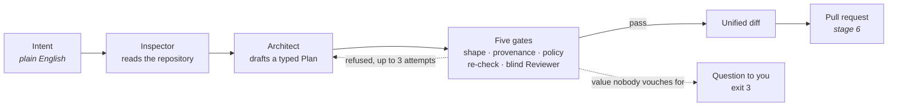

<h1 align="center">idp-agent</h1>

<p align="center">
  <strong>An AI agent for platform teams whose infrastructure is declared as Backstage
  catalogue entities — the <code>catalog-info</code> YAML in a Git repository.</strong><br>
  Ask it a question in plain words and the engine answers from those declarations; ask it
  for a change and it returns a checked plan, rendered as a unified diff of the YAML it
  would add. Nothing is written yet: the branch and the pull request, whose merge is the
  approval, are stages 5 and 6.
</p>

<p align="center">
  <a href="https://github.com/pcaboor/idp-agent/actions/workflows/ci.yml"></a>
  <a href="LICENSE"></a>
  
  
  <!-- TODO: npm badge once published — https://img.shields.io/npm/v/idp-agent -->
</p>

<!-- TODO: the asciinema recording planned for stage 7 goes here -->

## Try it in 60 seconds, without a key

```bash
git clone https://github.com/pcaboor/idp-agent && cd idp-agent
pnpm install && pnpm build     # Node 22 or later, pnpm 10
pnpm demo                      # the steps below, end to end
```

Each command reads a fictional company, the demo SI in `fixtures/si-demo/` (33
entities), and none calls a model. What breaks if the database server `mysql-prod-01`
fails — every path, from the declarations:

```text
$ node dist/cli/bin.js relations mysql-prod-01 --impacts --demo
reading the demo SI, a fictional company; pass --repo <directory> to read your own declarations repository
resource:default/mysql-prod-01

impacts (9)
  ENTITY                                        TYPE             ENV   DEPTH  PATH
  resource:default/billing-db-prod              database         prod  1      mysql-prod-01 ← billing-db-prod
  resource:default/compliance-db-prod           database         prod  1      mysql-prod-01 ← compliance-db-prod
  resource:default/orders-db-prod               database         prod  1      mysql-prod-01 ← orders-db-prod
  resource:default/billing-api-billing-db-prod  database-access  prod  2      mysql-prod-01 ← billing-db-prod ← billing-api-billing-db-prod (readwrite)
  resource:default/orders-api-orders-db-prod    database-access  prod  2      mysql-prod-01 ← orders-db-prod ← orders-api-orders-db-prod (readwrite)
  resource:default/reporting-billing-db-prod    database-access  prod  2      mysql-prod-01 ← billing-db-prod ← reporting-billing-db-prod (read)
  component:default/billing-api                 service          -     3      mysql-prod-01 ← billing-db-prod ← billing-api-billing-db-prod (readwrite) ← billing-api
  component:default/orders-api                  service          -     3      mysql-prod-01 ← orders-db-prod ← orders-api-orders-db-prod (readwrite) ← orders-api
  component:default/reporting-worker            service          -     3      mysql-prod-01 ← billing-db-prod ← reporting-billing-db-prod (read) ← reporting-worker
```

`show billing-api --demo` says what one entity is and what it depends on. A change comes
back as the diff it would make. Here the plan is read from a file that stands where the
model's draft would, so no model is involved; it still goes through the signature, the
policies and the re-check against the repository, and the repository is left byte for
byte as it was. Its request names `resource:default/payments-api` by its reference in
full, and the flow's environment is the one that declaration states — an environment is
never read from the words of a request:

```text
$ node dist/cli/bin.js plan --from examples/open-network.json --repo fixtures/si-demo
--- /dev/null
+++ b/dependencies/network/orders-api-to-payments.yml
@@ -0,0 +1,14 @@
+---
+apiVersion: backstage.io/v1alpha1
+kind: Resource
+metadata:
+  name: orders-api-to-payments
+  annotations:
+    company.fr/env: prod
+spec:
+  type: network-access
+  owner: group:default/tiger
+  dependsOn:
+    - resource:default/payments-api
+  dependencyOf:
+    - component:default/orders-api

1 file · nothing written
Nothing is provisioned yet. The merge is what authorises it.
```

`company.fr/env` is the demo company's annotation for an environment, and this build
reads and writes that same annotation in every repository: it is not configurable yet.

A value nobody can vouch for — in the request, or in the repository — is asked, never
guessed: here the owner, and the database's environment, which "in prod" does not state.
In a terminal the question comes at a prompt; piped or in CI, as here, it is printed and
the run exits 3. [`examples/`](examples) lists every plan with its exit code.

```text
$ node dist/cli/bin.js plan --from examples/needs-an-owner.json --repo fixtures/si-demo
2 questions, asked rather than guessed:

  operations.0.entity.metadata.env
      nothing vouches for this env; which one is it?
      the draft says prod · in use: dev, prod, staging
  operations.0.entity.spec.owner
      nothing vouches for this owner; which one is it?
      the draft says group:default/platform-wizards

Fill them in and run this again. Nothing was previewed, and nothing was written.
```

## With your own key

`idpa "<phrase>"` takes a question or a change, and the model decides which. It needs one
provider, which you choose; none is the default.

| `IDP_PROVIDER` | key variable | recorded with (`tests/recordings/`) |
|---|---|---|
| `openai` | `OPENAI_API_KEY` | `gpt-6-luna` — the plan tapes |
| `mistral` | `MISTRAL_API_KEY` | `mistral-small-2603` — the question tapes |
| `anthropic` | `ANTHROPIC_API_KEY` | no tape yet; what it is sent is checked by `tests/contract/providers.test.ts` |

```bash
pnpm link --global              # from the clone: idpa on your PATH (pnpm may ask for `pnpm setup` first; then open a new terminal)
export IDP_PROVIDER=openai      # or mistral, anthropic
export IDP_MODEL=<model id>
export OPENAI_API_KEY=<your key>

idpa "which databases are in prod?" --demo

cp -R fixtures/si-demo ~/demo-iac && cd ~/demo-iac
idpa "give reporting-worker read access to orders-db-prod in prod"
```

A question prints the engine's answer, with the model's sentences around it marked `›`. A
change is decided against the declarations repository you stand in — a copy of the demo
SI here, because a change is never previewed against the demo itself. What nobody can
vouch for is asked at a prompt — the level of a grant always, and the environment unless the
phrase names what the access is over by its reference in full — and the diff follows.
Neither writes anything. The CLI reads its environment and never loads a `.env` file:
[`.env.example`](.env.example) lists every variable it reads, for
`node --env-file=.env dist/cli/bin.js "<question>" --demo` from the clone. For a change,
stand in the declarations repository and name the clone by path —
`cd ~/demo-iac && node --env-file=<clone>/.env <clone>/dist/cli/bin.js "<change>"` — or
pass `--project`: run from the clone, whose root holds a `package.json`, the Inspector
would take idp-agent itself for the service and read it. A missing key is refused before
any agent starts — `no key for openai: set OPENAI_API_KEY`, exit 2 — and the key is sent
to its provider and nowhere else ([`SECURITY.md`](SECURITY.md)).

---

## Why idp-agent?

Internal developer platforms (IDPs) built on **Backstage** and **GitOps** run on
declarations: `catalog-info` YAML files in an infrastructure-as-code repository that CI
reconciles into databases, network access and firewall rules. Writing them by hand is slow
and error-prone. Letting an LLM write them unchecked is risky.

idp-agent sits between the two:

- 🗣️ **Natural language in, YAML out.** "Give billing-api read access to orders-db" becomes
  the exact entities to add, in your repository's own layout.
- 🔒 **The merge is the approval.** The agent proposes and a human reviews. Nothing is
  provisioned until a pull request is merged.
- 🧭 **Asks, never guesses.** Every owner must trace back to your request or to what your
  repository already holds, and every environment to a declaration you point at or to your
  answer; an access level is always yours to answer. Anything else becomes a question.
- ✂️ **Minimal diffs.** It edits the text surgically and never reformats a file, so a
  reviewer sees one added line, not a reshuffled file.
- 🧪 **Reproducible without an API key.** The whole suite runs offline from recordings:
  no network, no cost, no flaky model.

> Platform GitOps is the use case. The real subject is **how to build a reliable
> multi-agent LLM system**: deterministic orchestration, structural guardrails, a closed
> repair loop, and tests that never reach a model.

## Relations

Every dependency, traced from the declarations: what an entity consumes through its access
rights and who consumes it, what it depends on and what breaks if it fails, the APIs it
provides, and how two entities are related. Each row carries its whole path, the right on
it and the level that right states, and the entity's own environment; a reference declared
nowhere is shown where the path ends, beside the entity that has its name. No model and no
key; `--impacts` is on the first screen above, and `node dist/cli/bin.js` stands for `idpa`
until `pnpm link --global` puts it on your PATH.

```text
$ node dist/cli/bin.js relations reporting-worker --to mysql-prod-01 --demo
reading the demo SI, a fictional company; pass --repo <directory> to read your own declarations repository
component:default/reporting-worker

paths to resource:default/mysql-prod-01 (1)
  reporting-worker → reporting-billing-db-prod (read) → billing-db-prod → mysql-prod-01
    STEP                                        TYPE             ENV   ACCESS
    component:default/reporting-worker          service          -
    resource:default/reporting-billing-db-prod  database-access  prod  read
    resource:default/billing-db-prod            database         prod
    resource:default/mysql-prod-01              database         prod
```

Two services neither of which depends on the other are still related when the files say so:
`--to` then prints the nearest entities both reach, with the path from each end.

```text
$ node dist/cli/bin.js relations reporting-worker --to billing-api --demo
reading the demo SI, a fictional company; pass --repo <directory> to read your own declarations repository
component:default/reporting-worker

paths to component:default/billing-api (0)
  no path where one depends on the other

both depend on (1)
  resource:default/billing-db-prod
    reporting-worker → reporting-billing-db-prod (read) → billing-db-prod
    billing-api → billing-api-billing-db-prod (readwrite) → billing-db-prod
    STEP                                          TYPE             ENV   ACCESS
    component:default/reporting-worker            service          -
    resource:default/reporting-billing-db-prod    database-access  prod  read
    resource:default/billing-db-prod              database         prod
    component:default/billing-api                 service          -
    resource:default/billing-api-billing-db-prod  database-access  prod  readwrite
```

`--consumes`, `--consumed-by`, `--depends-on`, `--impacts`, `--provides` and
`--provided-by` pick one relation; with none, every relation that holds something is
printed. `--depth <n>` follows more hops (`--consumes` stops at what each right is over),
and every bound the walk reaches is said under the table, never left for you to assume the
list complete.

The same answer is one question away. Asked in words, the model only **chooses** the
entity and the relation, from references a tool returned; the engine computes the paths
and prints them with the renderer above, so the block is the command's. The lines marked
`›` are the model's (the ones below are illustrative):

```console
$ idpa "which services use billing-db-prod?"
› Two services reach billing-db-prod, each through its own right.

resource:default/billing-db-prod

consumed by (2)
  ENTITY                              TYPE     ENV  ACCESS     VIA                                                  DEPTH  PATH
  component:default/billing-api       service  -    readwrite  resource:default/billing-api-billing-db-prod (prod)  2      billing-db-prod ← billing-api-billing-db-prod (readwrite) ← billing-api
  component:default/reporting-worker  service  -    read       resource:default/reporting-billing-db-prod (prod)    2      billing-db-prod ← reporting-billing-db-prod (read) ← reporting-worker

› Only billing-api may write to it.
```

## How it works


```mermaid
flowchart LR
    I["Intent<br/><i>plain English</i>"] --> INS["Inspector<br/>reads the repository"]
    INS --> A["Architect<br/>drafts a typed Plan"]
    A --> G["Five gates<br/>shape · provenance · policy<br/>re-check · blind Reviewer"]
    G -- pass --> D["Unified diff"]
    D --> PR["Pull request<br/><i>stage 6</i>"]
    G -. refused, up to 3 attempts .-> A
    G -. value nobody vouches for .-> Q["Question to you<br/>exit 3"]
```

1. The **Inspector** reads the repository you're standing in, or the one `--project` names.
2. The **Architect** proposes a `Plan` into a typed buffer, never free text.
3. **Five gates** judge it: schema shape, provenance (can each value be traced to a
   source?), policy, a re-check against the repository as it is now, and an independent
   Reviewer that never sees the Architect's reasoning.
4. After three failed attempts it stops cleanly.

The model decides *what to ask*. The deterministic engine answers, validates and renders.
A reference the tools never returned is refused, not printed.

An answer reads like a reply: the model may put a sentence before the engine's block and a
few after it, in the language of the question. Those lines are the model's, and marked `›`
so they are never mistaken for the verified part; the engine drops, whole, any sentence
naming an entity or an identifier no tool returned (ADR-0008). What they say in plain words
is not checked — the mark is what tells you so. `--quiet` prints the block alone.

```console
$ idpa "which databases are in prod?"
› These are the databases declared in production.

NAME                KIND      TYPE      ENV   OWNER
billing-db-prod     Resource  database  prod  group:default/tiger
compliance-db-prod  Resource  database  prod  group:default/common
mysql-prod-01       Resource  database  prod  group:default/common
orders-db-prod      Resource  database  prod  group:default/tiger

› The search matched on type and environment only.
› A database with no environment declared would not be listed here.
```

## Install

> **Not on npm yet.** Publishing is planned for stage 7 (`npx idp-agent`). Until then,
> run it from a clone.

```bash
git clone https://github.com/pcaboor/idp-agent && cd idp-agent
pnpm install && pnpm build
pnpm link --global          # exposes `idp-agent` and the short alias `idpa`
```

`pnpm link --global` needs a global bin directory on your PATH; pnpm says so and names
`pnpm setup`, which makes one, when there is none.

<!-- TODO: once published
```bash
npx idp-agent               # guided tour, no setup, no API key
npm install -g idp-agent
```
-->

**Requirements:** Node ≥ 22, pnpm 10. No Docker, no database, and no API key for anything
but the model-backed commands (`idpa "<phrase>"`, `ask`, `plan "<intent>"`, `init`). Those
need `IDP_PROVIDER`, `IDP_MODEL` and the provider's key, as [above](#with-your-own-key);
**none is configured by default**, and none is preferred. Two settings are optional:
`IDP_TIMEOUT`, the seconds one model call may take (120 by default), and
`IDP_SUPERVISOR_MODEL`, the Supervisor's model on the same provider (`IDP_MODEL` by
default). [`.env.example`](.env.example) explains every variable.

The key is read from the provider's own variable and never from the repository. A missing
key, an `IDP_TIMEOUT` that is not a positive number of seconds, or an `IDP_SUPERVISOR_MODEL`
holding a space or a control character, is refused with exit 2 before any agent starts.
The Supervisor only classifies a phrase as a question or a change, so its calls ask for a
low reasoning effort where the model takes one (an OpenAI reasoning model; the rule is in
[`src/llm/README.md`](src/llm/README.md)), and `IDP_SUPERVISOR_MODEL` can give it a
lighter model of the same provider and key. A model call that cannot succeed ends the run
with one line and exit 1: it did not answer within `IDP_TIMEOUT`, the provider refused the
key, rate-limited the call or failed, the request outgrew the model's context window, or
the model hit its output limit or a content filter before answering. A model-backed run
ends with one line on stderr saying how many model calls it made and the tokens the
provider reported for them.

## Commands

```bash
idpa "<phrase>" [--repo <dir> | --demo] [--project <dir>] [--json] [--quiet]
```

The daily gesture, typed from anywhere. The Supervisor reads the phrase and decides: a
**question** about the SI is answered as `ask` answers it, and an **intent** to change it
is previewed as `plan "<intent>"` previews it. Quotes are optional (`idpa which services
use billing-db` works) until the phrase holds `?`, `*`, `!`, a quote or a parenthesis,
which the shell reads first: zsh refuses an unquoted `?` it cannot match, and bash
replaces it with a file name. Any language the model reads will do. `idpa` is the short
name of `idp-agent`. A single word one slip away from a command — `idpa grpah` — is taken
for the typo it is and never sent to a model, and options go after a command
(`idpa show billing-api --repo IaC`), never before it. `--project` and `--json` apply to a
change only; a question with `--json` is answered as text, and stderr says so. `--quiet`
applies to a question only: the verified answer, without the model's sentences around it.
`ask` and `plan` below force a road: `plan` previews without classifying, and `ask`
classifies and only answers, declining a change.

```bash
idp-agent graph [--env <env>] [--type <type>] [--kind Component|Resource|API] [--repo <dir> | --demo]
idp-agent show <name-or-reference> [--repo <dir> | --demo]
idp-agent relations <name-or-reference> [--consumes | --consumed-by | --depends-on | --impacts | --provides | --provided-by | --to <name-or-reference>] [--depth <n>] [--repo <dir> | --demo]
idp-agent ask "<question>" [--repo <dir> | --demo] [--quiet]  # needs IDP_PROVIDER, IDP_MODEL and its key
idp-agent validate <directory>                     # what the generated CI runs
idp-agent init platform <dir> --owner @org/team    # the only command that writes
idp-agent plan --from <plan.json> [--repo <dir>]   # no model, and none is possible
idp-agent plan "<intent>" [--repo <dir>] [--json]  # needs IDP_PROVIDER, IDP_MODEL and its key
    [--project <dir>]                              # the service's repository, if not where you stand
idp-agent init [--repo <dir>]                      # the catalog-info.yaml it would write
    [--name <name>] [--lifecycle <lifecycle>]      # what its files do not state; asked at a terminal
    [--owner group:<namespace>/<name>]
idp-agent version                                  # or --version, -v
idp-agent <command> --help                         # its usage; -h or --help alone, every one
```

`init` writes nothing: it prints a diff of the service's repository and ends by saying how
to apply it. Save a run to a file, read it, and apply that file in the service's
repository — `idpa init > catalog-info.diff`, then `git apply catalog-info.diff`. Piping
`idpa init` straight into `git apply` runs the models again, and applies bytes nobody read.

| Command | What it does |
|---|---|
| `relations` | Trace one entity's relations, several hops deep, each with its path, the rights on it and their levels: `--consumes`, `--consumed-by`, `--depends-on`, `--impacts`, `--provides`, `--provided-by`, or `--to <entity>` for every path between two. No model. |
| `graph`, `show` | Walk the dependency graph: who depends on what, which services reach a database. `show` also says what an entity is — its description, system, tags and links, when its file declares them. A Backstage `kind: API` is read too — `graph --kind API`, and on `show` who provides it (`spec.providesApis`) and the rights that reach it — though no plan ever declares one. No model. |
| `idpa "<phrase>"` | A question is answered, a change is previewed; the classification is said on stderr (`· question`, `· mutation`). Needs a model. |
| `ask` | Answers a question about your platform. The model picks the queries; the engine answers them, and prints the model's short introduction and conclusion around the answer, checked and marked `›`. Asked about the catalogue as a whole — *talk about this project* — it prints an overview the engine writes: counts by kind, type, environment, owner, system and tag, a few entities in their own descriptions, rights and their levels, the most-reached resources, dangling references, and what it could not read. |
| `init platform` | Scaffolds the declarations repository, its CI, its Backstage registration and a branch-protection checklist. |
| `validate` | Checks a repository against the schemas. This is what the scaffolded CI runs. |
| `plan` | Turns an intent, or a `Plan` file, into a checked and previewed diff. |

`plan --repo` names the **declarations** repository. `init --repo` names the
**application** repository being declared. `graph`, `show`, `relations` and `ask` take the first kind;
without `--repo` they read the directory you are standing in when it is a declarations
repository (a folder under `catalog/` or `dependencies/` holding a `.witness.yml`, as
`init platform` writes them), then the one you configured (below), and the fictional demo
SI otherwise, or with `--demo`. Either way they say which on stderr, and name a repository
by its folder.

A change — `idpa "<intent>"` or `plan "<intent>"` — is decided against the declarations
repository, and may also read the **service's** repository, which the Inspector reads: the
one `--project <dir>` names, or the directory you stand in when it is an application
repository (a `catalog-info.yaml` or a package manifest — `package.json`, `go.mod`,
`pom.xml`, … — at its root). Anywhere else — the declarations repository or any folder of
it, your home directory, the filesystem root — the Inspector is skipped, said in one line
on stderr, and the plan is drafted from the catalogue alone. A `--project` that is not a
directory, is a declarations repository, is the `--repo` directory or one of its
`catalog/` and `dependencies/` folders is refused with exit 2 before any model is called.
`plan --from` inspects nothing and takes no `--project`.

**Exit codes:** `0` success · `1` negative answer (nothing matched, the repository doesn't
conform, or a gate refused the plan), a model call that failed, or a Backstage catalogue that
could not be read whole · `2` bad arguments or configuration, or no
model, no key or no usable `IDP_TIMEOUT` or `IDP_SUPERVISOR_MODEL` configured · `3`
understood but not acted on: a change request put to `ask`, a question the model refused,
or a value nobody can vouch for · `130` Ctrl-C at a question. An ambiguous name resolves
to nothing rather than to the first candidate.

### Use it from anywhere

`init platform` creates your declarations repository once; after that, name it once too,
and `idpa "<phrase>"`, `graph`, `show`, `relations`, `ask` and `plan` read it from any directory
without `--repo`. Either set `IDP_REPO`, or write a personal configuration file — never
committed, and holding no credential — at `$XDG_CONFIG_HOME/idp-agent/config.yml`, else
`~/.config/idp-agent/config.yml` (`%APPDATA%\idp-agent\config.yml` on Windows):

```yaml
repo: ~/work/IaC    # ~ is expanded; a relative path is relative to this file
```

`IDP_REPO` must be absolute or start with `~`: a relative one would name a different
repository in every directory, and is refused. In the file, a bare `~` is YAML's null —
write `repo: "~"` for the home directory itself.

Every command takes the first of: `--repo` (or `--demo`) · the directory you stand in,
when it is a declarations repository · `IDP_REPO` · `repo` in that file — and a question
and the read commands take a [Backstage catalogue](#read-a-backstage-catalogue) ahead of
each of the last two, when one is configured. With none of them, `graph`, `show`,
`relations` and a question read the fictional demo SI; a change is refused, naming those
four ways, because a write preview is decided against your repository, never a demo or a
catalogue. So `cd IaC && idpa "<intent>"` decides against IaC. Whatever was not typed is said
in one line on stderr, naming the folder and where it came from:

```
reading the declarations repository IaC (~/.config/idp-agent/config.yml); --repo <directory> reads another, --demo the fictional SI
```

A misspelt key, a file that is not YAML, or a configured path that is not a directory is
exit 2, naming the variable or the file — never a quiet fall back to the demo SI.

### Read a Backstage catalogue

With a Backstage, `graph`, `show`, `relations`, `ask` and a question answer from the
company's catalogue rather than from one repository: every service's `catalog-info`, the
real owners, the APIs. Point the same file at the catalogue API's base — not the app's URL
— or set `IDP_BACKSTAGE_URL`, which beats the file, and export the read token
([which one to issue](docs/adopting-backstage.md#the-read-token-for-idpa)):

```yaml
repo: ~/work/IaC                                      # still what a change is decided against
backstage: https://backstage.acme.example/api/catalog
```

```console
$ export IDP_BACKSTAGE_TOKEN=…     # from the environment only: no file and no flag holds it
$ idpa relations mysql-prod-01 --impacts
reading the Backstage catalogue at backstage.acme.example (~/.config/idp-agent/config.yml): 36 entities: 33 read, 3 not modelled; it may lag the declarations repository by minutes; --repo <directory> reads a repository
```

For a read, `IDP_BACKSTAGE_URL` beats `IDP_REPO` and the file's `backstage` beats its `repo`,
but the environment beats the file: an exported `IDP_REPO` wins over a catalogue set in the
file. The directory you stand in, when it is a declarations repository, beats them all, and
`--backstage` chooses the catalogue there.
It is read over HTTP once per run, **before any model is called**, through the reader a YAML
file goes through, and a change is still decided against the declarations repository alone.
The token is sent to that catalogue alone, on two read routes, and nowhere else
([`SECURITY.md`](SECURITY.md)). A catalogue read in part is never answered from: a server
that refuses the token, cannot be reached or serves less than it announced is exit 1, one
line naming the host and what named it; a URL or a token refused before any request is
exit 2.

What a question reads from the catalogue — names, descriptions, owners, links, from every
team's `catalog-info`, not only the one reviewed repository — reaches your model provider
in the agents' tool results, and MLflow when tracing is on. The stderr line names the
catalogue on every run; there is no other notice. The Supervisor and the Analyst are shown
at most 30 values of each vocabulary list, the most frequent, so a catalogue of 300 teams
does not put 300 owners in every prompt.

What the catalogue cannot report: an entity Backstage refused never reaches its API, and a
duplicate is resolved "first location wins" in silence. A catalogue read reports only what
this tool's reader refuses; `validate` in the declarations repository reports the rest.

No Backstage to hand? A fake one serves the demo SI, with three Groups, on loopback — Node
22.18 or later, which runs its TypeScript as it is:

```console
$ pnpm demo:backstage            # starts it on a free port, runs relations, show and plan --from against it, stops it
```

or by hand, the fake in one terminal (`node tools/fake-backstage.ts`, on 127.0.0.1:7007)
and in another:

```console
$ env -u IDP_BACKSTAGE_TOKEN IDP_BACKSTAGE_URL=http://127.0.0.1:7007/api/catalog node dist/cli/bin.js relations mysql-prod-01 --impacts
reading the Backstage catalogue at 127.0.0.1:7007 (IDP_BACKSTAGE_URL): 36 entities: 33 read, 3 not modelled; it may lag the declarations repository by minutes; --repo <directory> reads a repository
not loaded: 3 documents this tool does not model (Group ×3)
resource:default/mysql-prod-01

impacts (9)
…
```

The table is the one at the top of this page. A token set is sent to whatever catalogue is
configured, a loopback one included — which is why the fake's command starts with
`env -u IDP_BACKSTAGE_TOKEN`, and why `pnpm demo:backstage` removes it from what it runs.

### See it in a real Backstage

With Docker, one command builds and starts a real Backstage 1.55.2 holding the demo SI —
our own minimal image, [`tools/backstage/`](tools/backstage/README.md), registered through
the Location `init platform` writes and configured as
[`docs/adopting-backstage.md`](docs/adopting-backstage.md) says — runs `idpa` against it, and
stops it:

```console
$ pnpm build && pnpm demo:backstage:docker
```

Or keep it running with `pnpm backstage:up`, browse the catalogue at `http://127.0.0.1:7007`
(guest sign-in, a demo convenience), and query the same catalogue from any directory that is
not a declarations repository, with its read token — a demo value, public in this
repository:

```console
$ env -u IDP_REPO IDP_BACKSTAGE_URL=http://127.0.0.1:7007/api/catalog IDP_BACKSTAGE_TOKEN=idpa-demo-read-only-token idpa relations mysql-prod-01 --impacts
reading the Backstage catalogue at 127.0.0.1:7007 (IDP_BACKSTAGE_URL): 40 entities: 33 read, 7 not modelled; it may lag the declarations repository by minutes; --repo <directory> reads a repository
not loaded: 7 documents this tool does not model (Group ×4, Location ×3)
resource:default/mysql-prod-01

impacts (9)
…
$ pnpm backstage:down
```

The table is the one at the top of this page, byte for byte. Everything listens on
127.0.0.1 only. Without the token the catalogue answers 401 and `idpa` says so, exit 1; the
token reads and can do nothing else. Guest sign-in means anything on this machine can act as a
user of this demo catalogue, writes included: the 401 shows `idpa`'s refusal, not a closed
catalogue, so stop it when you are done.

## Design principles

The full doctrine is in [`docs/design.md`](docs/design.md) §4, and it isn't negotiable:

- **The merge is the act of authorisation.** The CLI will open a pull request (stage 6)
  and never write to the main branch.
- **Textual surgery, never a reparse.** A reviewer must see an added line, not a
  reformatted file.
- **Declare, never infer.** What is unknown is reported as unknown. An automaton reports;
  it doesn't delete.

It builds on a declarative reconciliation system that ran in production (CI/CD triggered
on `catalog-info.yml`, a central IaC repository, provisioning through an API gateway,
firewall automation and ticketing) and adds the multi-agent layer that system never had.

## Roadmap

| # | Stage | State |
|---|---|---|
| 0 | Foundations: schemas, serialiser, paths, invariants | ✅ |
| 1 | Read-only: `graph`, `show <entity>` | ✅ |
| 2 | Question mode: Supervisor, recordings | ✅ |
| 3 | `init platform` + `validate` | ✅ |
| 4 | Preview only: Inspector, Architect, `Plan`, diff; writes nothing | ✅ |
| 5 | Write + local branch: atomicity, idempotence | 🚧 |
| 6 | GitHub pull request: real forge, negative token test | |
| 6b | [Read the live catalogue](docs/backstage-http-brief.md): questions and relations against a running Backstage (`backstage-http`); no Backstage needed to use the tool | 🚧 |
| 7 | Polish: Ink TUI, asciinema, npm publish | |
| 8 | [Discovery](docs/stage-8-brief.md): catalogue an existing service and its dependencies; preview-only until 5–6 land, submission after 6 | |

The order follows the doctrine: read first, validate before the first write, preview
before the pull request. Today **no preview writes anything** — the test suite and
`pnpm smoke` hash every byte around a full run to prove it — and `init platform` writes
only into the directory it is handed.

No Backstage is needed, and adopting one later is one registration: [`docs/adopting-backstage.md`](docs/adopting-backstage.md).

What comes next and the owner's decisions: [`docs/roadmap.md`](docs/roadmap.md). What each pull request changed: [`CHANGELOG.md`](CHANGELOG.md).

## FAQ

**Is this a Backstage plugin?**
No. It's a standalone CLI that reads Backstage-compatible `catalog-info` YAML in a Git
repository, and previews what it would add; writing it is stage 5. It doesn't need a
running Backstage instance, and reads one's catalogue when you configure it
([above](#read-a-backstage-catalogue)); it never writes to it.

**Which LLMs does it support?**
Anthropic, Mistral and OpenAI, chosen with `IDP_PROVIDER` and `IDP_MODEL`. None is the
default.

**Can the AI change my infrastructure on its own?**
No. At most it proposes a diff. Once stage 6 opens the pull request, a human merges it,
and the merge is what triggers provisioning.

**Do I need an API key to try it?**
No. `pnpm demo`, the tests, `graph`, `show`, `relations`, `validate`, `init platform` and
`plan --from` all run without a model. A question or a change in words needs one.

## Documentation

| File | For |
|---|---|
| [`AGENTS.md`](AGENTS.md) | a coding agent, or anyone, opening the repository cold |
| [`docs/design.md`](docs/design.md) | the full specification: doctrine, architecture, journeys |
| [`docs/plans/`](docs/plans) | the per-stage implementation plans, task by task |
| [`docs/reviews/`](docs/reviews) | dated code reviews: what was found, at which commit |
| [`examples/`](examples) | ready-made `Plan` files, one per outcome |
| [`SECURITY.md`](SECURITY.md) | the threat model, and what is *not* guaranteed |
| [`CONTRIBUTING.md`](CONTRIBUTING.md) | three commands and the rules the CI enforces |

## Licence

Apache-2.0, the licence of Backstage, Kubernetes and Terraform. Its explicit patent grant
lets a company's legal team adopt the project without friction.

<!-- Keywords: AI agent, platform engineering, internal developer platform, IDP, Backstage,
software catalog, GitOps, infrastructure as code, IaC, LLM, multi-agent, pull request
automation, OpenAI, Anthropic, Mistral -->
